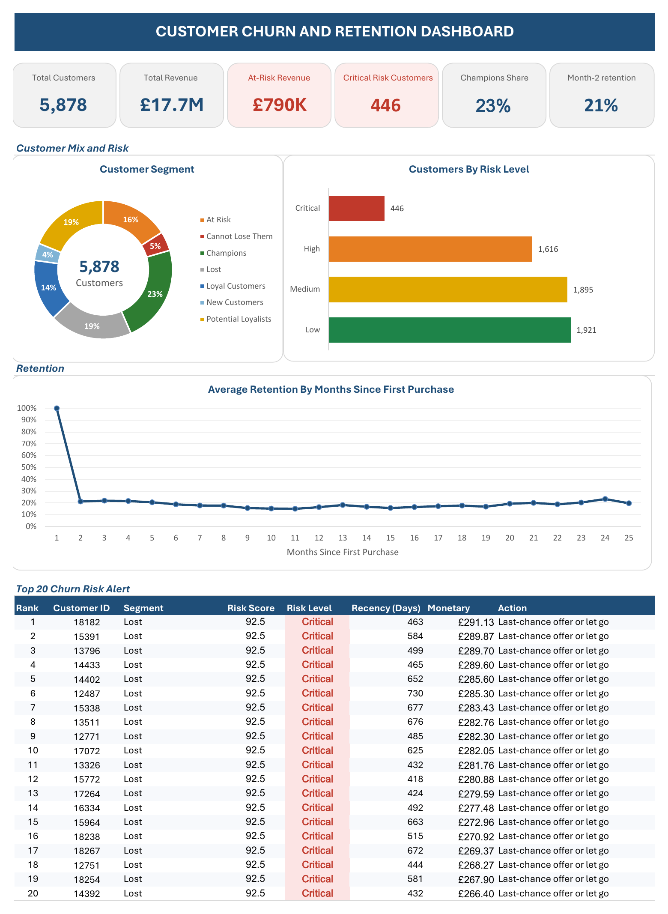

# Customer Churn and Cohort Retention Engine

An Excel analytics workbook that tracks how customers of a UK online retailer stick around after their first purchase, segments them by value with RFM scoring, flags who is likely to churn, and estimates what a retention campaign is worth.



## The business question

Which customers are we losing, how fast, and is it worth spending money to win them back?

The workbook answers this in four steps:

1. **Cohort retention:** of the customers who first bought in a given month, what share came back in each later month?
2. **RFM segmentation:** who are the best customers, who has gone quiet, and who is already lost?
3. **Churn risk scoring:** a 0–100 risk score and an action for every customer.
4. **Revenue impact:** what a retention campaign would recover, net of its cost, across different success rates.

## Key findings

- **Most customers don't come back after the first month.** On average only **21%** of a cohort buys again in month 2. After that, retention stays roughly flat at 15–24% for two years. The second purchase is the critical moment.
- **Over a quarter of customers bought exactly once.** 1,623 of 5,878 customers (27.6%) placed a single order and never returned.
- **Early customers are the most loyal.** The December 2009 cohort retained 35% in month 2, about 14 points above the average. It also peaked at 49.5% in month 12, which is November 2010, showing a strong pre-holiday buying cycle.
- **Churn risk is concentrated in low-value customers.** 2,062 customers are High or Critical risk, but they hold only **£790K (4.5%)** of the £17.7M total revenue. High spenders mostly score as low risk, so a broad win-back campaign aimed at everyone at risk would spend money on low-value accounts.
- **A retention campaign pays off at a very low success rate.** Contacting the 2,062 at-risk customers at £5 each costs £10,310. That breaks even if the campaign keeps just **1.3%** of their revenue. At a 15% retention improvement, the net benefit is about **£108K**.

## Dataset

[Online Retail II](https://archive.ics.uci.edu/dataset/502/online+retail+ii) from the UCI Machine Learning Repository: every transaction from a UK-based online gift retailer between 1 December 2009 and 9 December 2011.

| | Raw | After cleaning |
| --- | --- | --- |
| Transaction lines | 1,067,371 | 805,549 |
| Customers | 5,942 | 5,878 |
| Invoices | | 36,969 |
| Revenue | | £17,743,429 |

The raw file isn't included in this repo because of its size. Download it from the link above.

Chen, D. (2012). *Online Retail II* [Dataset]. UCI Machine Learning Repository. https://doi.org/10.24432/C5CG6D. Licensed under [CC BY 4.0](https://creativecommons.org/licenses/by/4.0/).

## Data cleaning

| Step | Rule | Rows remaining |
| --- | --- | --- |
| Combine both years | Append the 2009–2010 and 2010–2011 sheets | 1,067,371 |
| Remove anonymous transactions | Customer ID is not blank | 824,364 |
| Remove returns | Quantity > 0 | 805,620 |
| Remove free items | Price > 0 | 805,549 |
| Remove cancelled invoices | Invoice does not start with "C" | 805,549 |

The cancellation filter removed no extra rows, because every cancelled invoice is recorded as a negative quantity and was already caught by the returns filter. It stays in the pipeline as a safeguard.

Three columns were added to each transaction: **Revenue** (Quantity × Price), **InvoiceMonth** (the first day of the purchase month) and **CohortIndex** (months since the customer's first purchase, starting at 1).

Full step-by-step detail is in [docs/data_cleaning.md](docs/data_cleaning.md).

## Methodology

### Cohort retention

Each customer is assigned to the month of their first purchase. A PivotTable counts distinct customers by cohort month and CohortIndex. A second sheet divides each cell by the cohort's month-1 size to get retention percentages, shown as a heatmap.

The bottom-right of the matrix is empty by design. A customer who first bought in mid-2011 can't have a month-20 value yet, because the data ends in December 2011. These cells are left blank rather than shown as 0%, so recent cohorts don't look as if they churned.

### RFM segmentation

| Measure | Definition | How it's scored (1–5) |
| --- | --- | --- |
| Recency | Days from the customer's last purchase to 9 Dec 2011 | Quintiles; fewer days scores higher |
| Frequency | Number of distinct invoices | Quintiles; more invoices scores higher |
| Monetary | Total revenue | Quintiles; more spend scores higher |

Score combinations map to seven segments:

| Segment | Rule | Customers | Share |
| --- | --- | --- | --- |
| Champions | R ≥ 4, F ≥ 4, M ≥ 4 | 1,348 | 22.9% |
| Lost | Everyone not matched by another rule | 1,138 | 19.4% |
| Potential Loyalists | R ≥ 3, F ≤ 3 | 1,105 | 18.8% |
| At Risk | R ≤ 2, F ≥ 3 | 939 | 16.0% |
| Loyal Customers | R ≥ 3, F ≥ 4 | 845 | 14.4% |
| Cannot Lose Them | R ≤ 2, F ≥ 4, M ≥ 4 | 266 | 4.5% |
| New Customers | R ≥ 4, exactly 1 purchase | 237 | 4.0% |

Rules are applied top to bottom in this order: Cannot Lose Them, Champions, Loyal Customers, At Risk, New Customers, Potential Loyalists, Lost. Each customer takes the first segment that matches.

**One deliberate exception:** New Customers uses the raw purchase count instead of the Frequency score. So many customers bought only once that the lowest Frequency quintile can't be isolated, which left this segment empty under pure quintile scoring.

### Churn risk score

```
Risk score = (5 − R) × 10 + (5 − F) × 7.5 + (5 − M) × 7.5
```

Recency carries the most weight (40%), with Frequency and Monetary at 30% each. The score runs from 0 (best customer) to 100 (most at risk).

| Risk level | Score | Customers | Recommended action |
| --- | --- | --- | --- |
| Low | 0–30 | 1,921 | Maintain |
| Medium | 31–60 | 1,895 | Monitor, light engagement |
| High | 61–85 | 1,616 | Aggressive win-back campaign |
| Critical | 86–100 | 446 | Last-chance offer or let go |

Because scores come from 1–5 bands, many customers share the same score. A tie-breaker on revenue gives every customer a unique rank, which drives the Top 20 alert table on the dashboard.

### Revenue impact model

Two editable inputs, a retention improvement rate and a campaign cost per customer, feed a net-benefit calculation for the High and Critical group. An Excel Data Table runs the model at retention rates from 5% to 50%:

| Retention improvement | Net benefit |
| --- | --- |
| 5% | £29,199 |
| 15% | £108,217 |
| 25% | £187,234 |
| 50% | £384,779 |

## Workbook guide

| Sheet | Purpose |
| --- | --- |
| Executive Dashboard | One-page summary: KPIs, segment mix, risk levels, retention curve, top 20 alerts |
| Customer Cohort Lookup | Each customer's first purchase month |
| Cohort Analysis | PivotTable of distinct customers by cohort and month |
| RFM Base | PivotTable of frequency, revenue and last purchase date per customer |
| Clean Data | 805,549 cleaned transactions with calculated columns |
| Cohort Retention Heatmap | Retention percentages, colour scale and survival curve |
| RFM Segmentation | R, F and M values, scores and segment per customer |
| Churn Risk Scorer | Risk score, level, action and rank per customer |
| Revenue Impact Model | Editable inputs and the what-if Data Table |
| Dashboard Data | Pivots and KPI calculations behind the dashboard |

To explore the model, change the yellow input cells on **Revenue Impact Model**. Everything downstream updates. If numbers look out of date, use **Data → Refresh All**.

## Excel techniques used

- **PivotTables on the Data Model**, using Distinct Count for customers and invoices
- **PivotCharts** for the segment and risk-level charts
- **What-if analysis** with a one-variable Data Table
- **Lookups and aggregation:** `INDEX`/`MATCH`, `MINIFS`, `COUNTIF`, `SUMIF`, `GETPIVOTDATA`
- **Scoring and ranking:** `PERCENTILE.INC` quintiles, nested `IF` segment rules, `RANK.EQ` with a tie-breaker
- **Date logic:** `DATEDIF` for months since first purchase
- **Conditional formatting:** heatmap colour scales and risk-level highlighting

**Designing for 805K rows.** Calculating each customer's first purchase month directly on every transaction row with `MINIFS` would scan the full table 805,549 times. Instead, it's calculated once per customer (5,878 times) on Customer Cohort Lookup, and each transaction looks the result up with `INDEX`/`MATCH`. This keeps the workbook recalculating in seconds rather than hanging.

## Limitations

- **Duplicate rows were kept.** 26,124 cleaned rows (3.2%) are exact duplicates, worth about 2.1% of revenue. They don't affect customer counts, cohorts or frequency, but they slightly raise revenue and Monetary values. See [data cleaning](docs/data_cleaning.md#known-issues-kept-in-the-data).
- **Revenue at risk is a proxy.** It uses each customer's past revenue to stand in for what they'd spend in future, which may overstate or understate the real value.
- **Risk weights are set, not trained.** The 40/30/30 weighting is a reasoned starting point, not fitted to actual churn outcomes. A next step would be to train a model on whether customers bought again.
- **Recent cohorts are incomplete.** Customers who joined late in 2011 have had little time to show repeat behaviour, and December 2011 covers only nine days.
- **RFM is a single snapshot** taken at 9 December 2011, so it doesn't show how customers move between segments over time.

## Repository structure

```
├── README.md
├── Churn_Retention_Engine.xlsx
├── Churn_Retention_Engine_Dashboard.pdf
├── images/
│   └── dashboard.png
└── docs/
    └── data_cleaning.md
```

## Author

**Omoyajowo David**: data analyst focused on analytics, machine learning and AI automation.

[LinkedIn](https://www.linkedin.com/in/omoyajowo-david-56524a217) · [GitHub](https://github.com/Jows1?tab=repositories)
